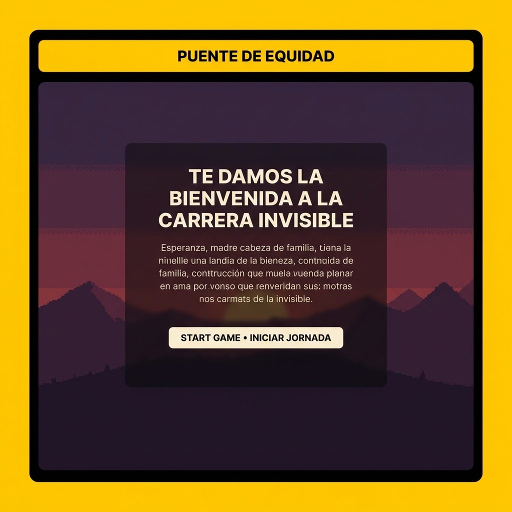

# Run and deploy your AI Studio app

This contains everything you need to run your app locally.
https://ai.studio/apps/3e80dcaa-2e06-4aa4-b27a-f9becebd406d

## Run Locally

**Prerequisites:**  Node.js

1. Install dependencies:
   `npm install`
2. Set the `GEMINI_API_KEY` in [.env.local](.env.local) to your Gemini API key
3. Run the app:
   `npm run dev`